ML Excercise 1

ML-Excercise-01.py            original excercise code

ML-Excercise-01-upgraded      Graph upgrade to check different alphas(training rate).

Graphs below show the different alpha values up to 0,02 with 1800 iterations.
Alpha 0,03 diverge. 

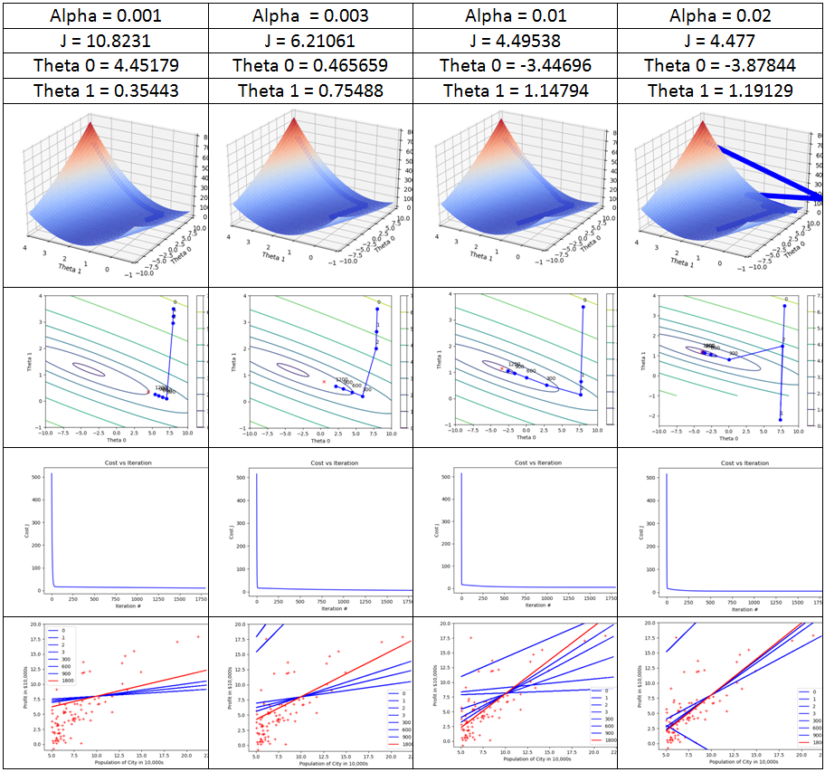

ML-Excercise-01-optional.py             optional excercises code

ML-Excercise-01-optional-upgraded.py    Graph upgrade 3D function

To help on comparition between analytic and iteration a function to denormalize coeficient was created.

def coeff_denormalization(theta,mu,sigma):

    theta_new = np.zeros((theta.shape[0],1))
   
    theta_new[0] = theta[0]
    for i in range (1,theta.shape[0]):
        theta_new[0] = theta_new[0]+theta[i]*(0-mu[0,i-1])/sigma[0,i-1]
        theta_new[i] = theta[i]/sigma[0,i-1]
         
    return theta_new

#Alpha = 0,001

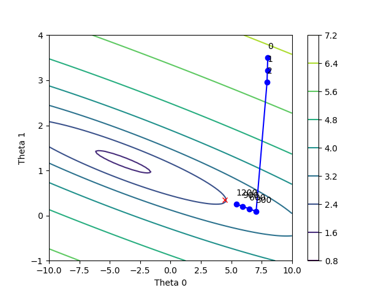
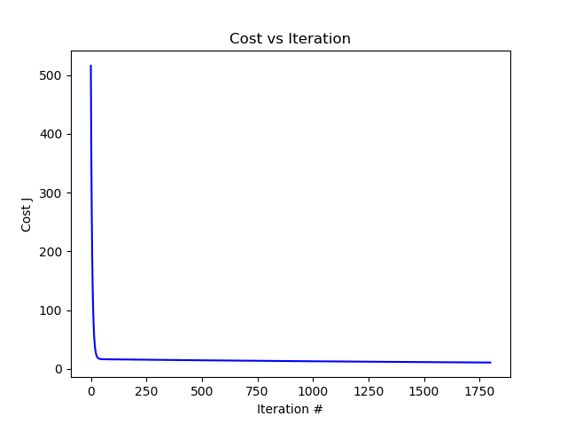
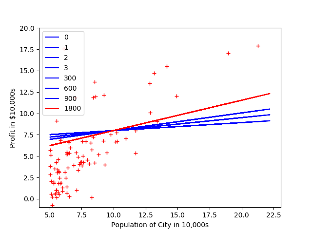

#Alpha = 0,003

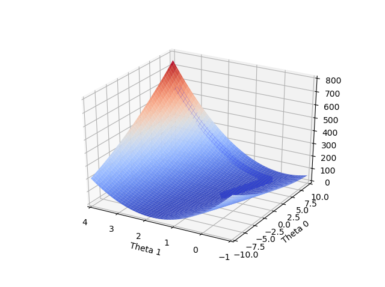
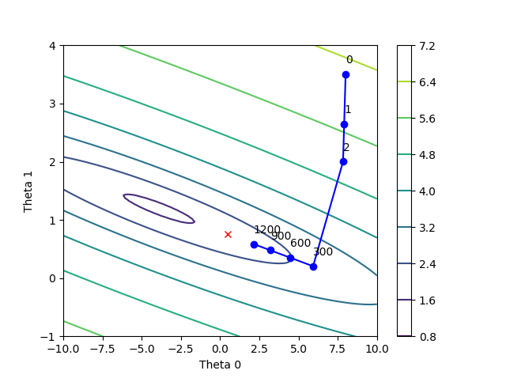
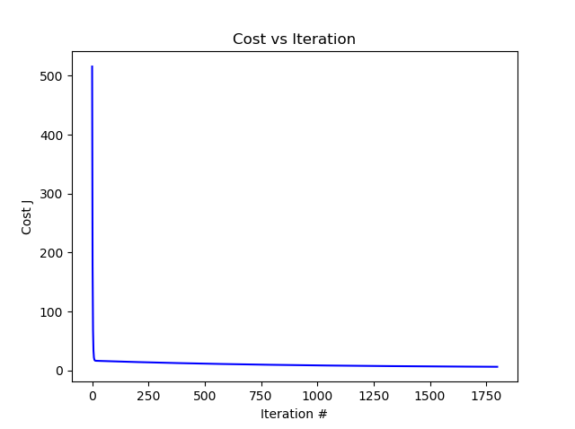
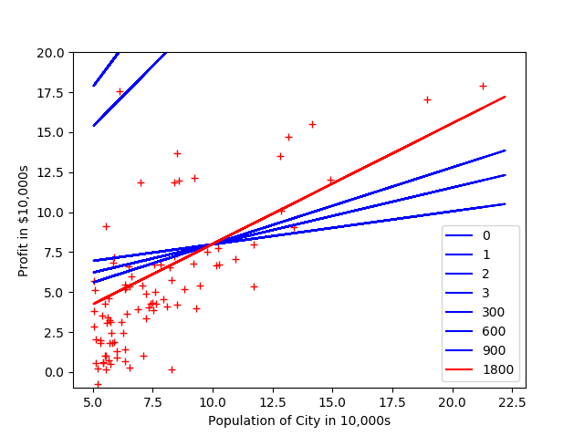

#Alpha = 0,01

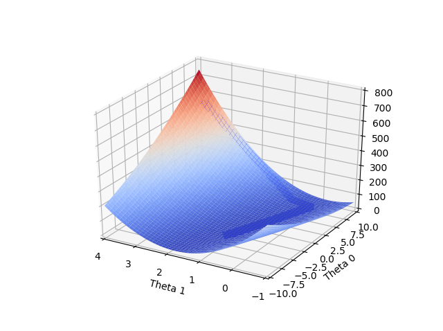
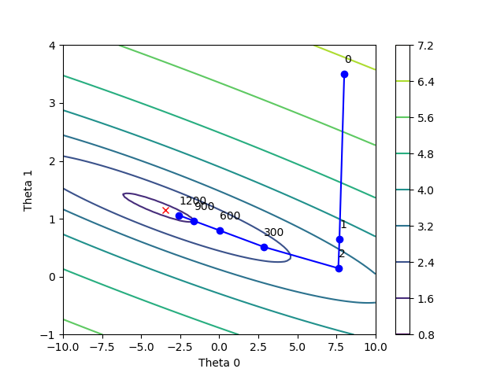
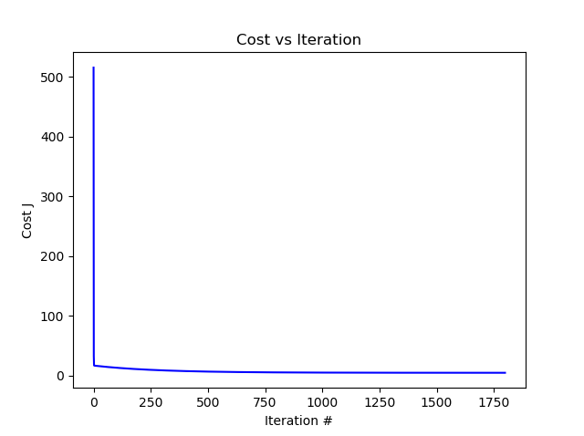
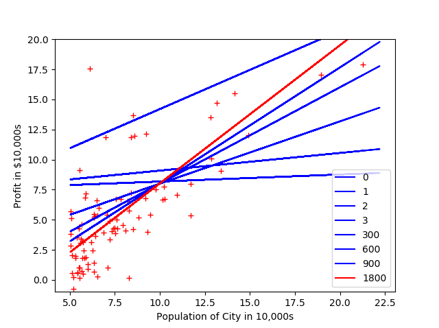

#Alpha = 0,02 

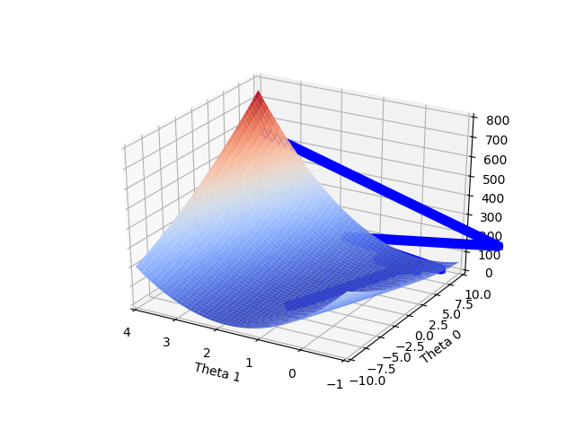
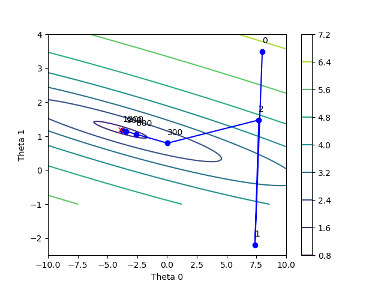
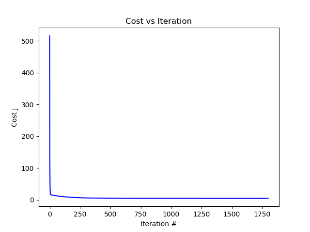
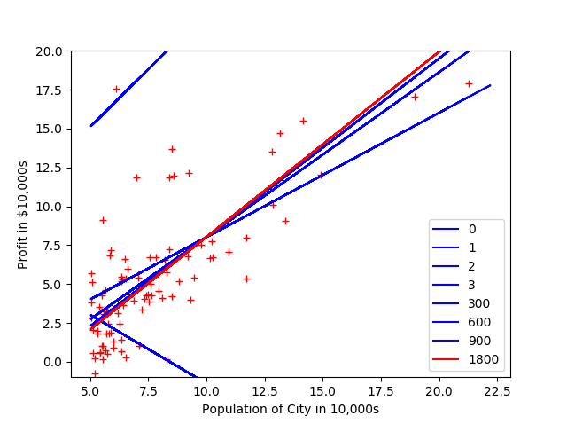

