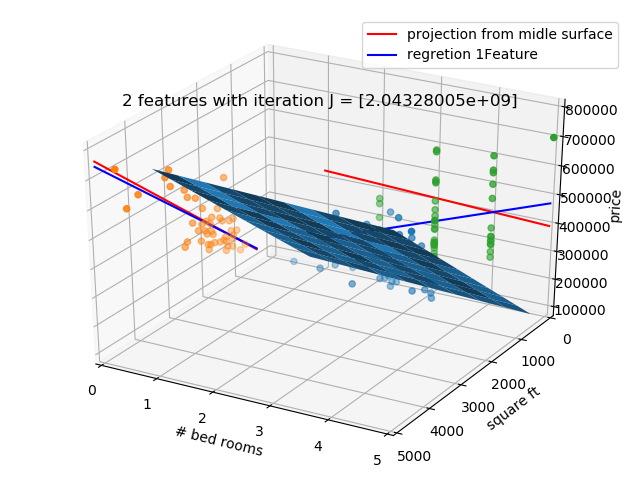

ML Exercise 1

ML-Exercise-01.py            original exercise code

ML-Exercise-01-upgraded      Graph upgrade to check different alphas (training rate).

Graphs below show the different alpha values up to 0.02 with 1800 iterations.
Alpha 0.03 diverge. 

ML-Exercise-01-optional.py             optional exercises code

ML-Ecercise-01-optional-upgraded.py    Graph upgrade 3D function

In order to help on comparison between analytic and iteration a function to denormalize coefficient was created.

def coeff_denormalization(theta,mu,sigma):

    theta_new = np.zeros((theta.shape[0],1))
   
    theta_new[0] = theta[0]
    for i in range (1,theta.shape[0]):
        theta_new[0] = theta_new[0]+theta[i]*(0-mu[0,i-1])/sigma[0,i-1]
        theta_new[i] = theta[i]/sigma[0,i-1]
         
    return theta_new

After verify polinomical option on each feature alone it was found that (Sq feet)^2 and (Sq feet)^3 don't make much imrpovment against Sq feet by itself.
#room^3 improve against #room from R^2 0.1956 to 0.2759.
So we add the following features:
Feature1: Sq feet
Feature2: #room
Feature3: #room^2
Feature4: #room^3
Feature5: Sq feet * #room

3D Graphs below show the different result using different # of features.
Notice that even when #room by itself has a positive coefficient when combining it gets negative.

Cost does not show great improvment between Feature 1 and the other combinations.

#Alpha = 0,001

#Alpha = 0,003

#Alpha = 0,01

#Alpha = 0,02 

